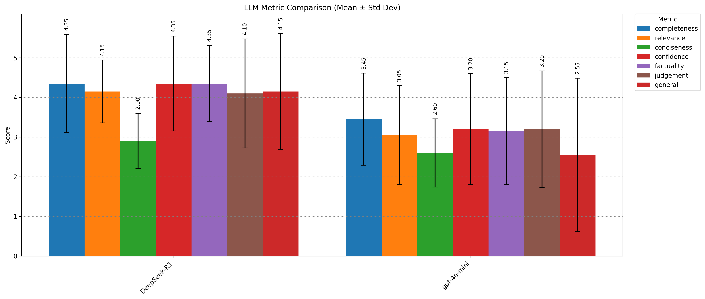
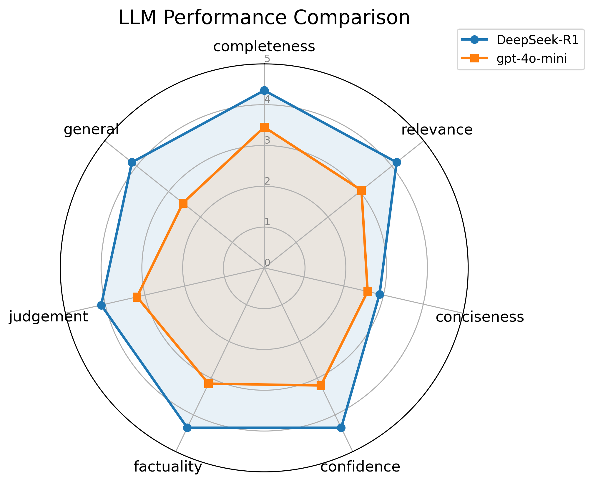
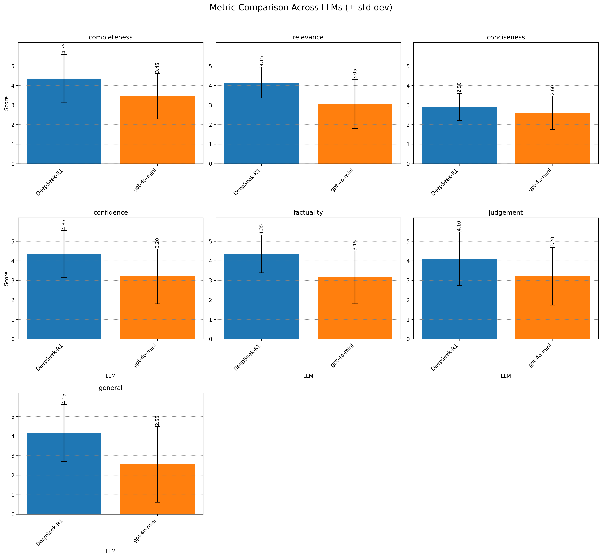

# LLM Evaluation Framework

[](https://www.python.org/)

[](https://opensource.org/licenses/MIT)
[](https://github.com/nsourlos/semi-automated_installation_exe_msi_files-Windows_10)

A Python-based framework for evaluating Large Language Models (LLMs) based on [Anthropic's research paper](https://arxiv.org/pdf/2411.00640) and using the [DRACO AI dataset](https://huggingface.co/datasets/draco-ai/trial01).

## 📋 Table of Contents
- [Quick Start](#🚀-quick-start)
- [Features](#✨-features)
- [Installation](#📥-installation)
- [Configuration](#⚙️-configuration)
- [Usage](#🚀-usage)
- [Project Structure](#📁-project-structure)
- [Example Plots](#📊-example-plots)
- [Contributing](#🤝-contributing)
- [Troubleshooting](#🔧-troubleshooting)
- [License](#📄-license)

## 🚀 Quick Start
1. Clone the repo
2. Set up environment variables
3. Install dependencies
4. Run [`python main.py`](main.py)

---

## ✨Features
- **🤖 Multiple Model Support**: OpenAI, Anthropic, Together AI, Groq, OpenRouter, Gemini, HuggingFace
- **📊 Evaluation Metrics**: Completeness, relevance, conciseness, confidence, factuality, judgement, and custom
- **🔍 RAG Implementation**: FAISS vectorstore with BGE embeddings and reranking
- **🛠️ Tool Usage**: Code execution, simulation running, SmolAgents integration
- **⚖️ Multiple Judges**: Support for secondary judge models
- **📈 Statistical Analysis**: Comprehensive statistics and visualization
- **🌐 Cross-Platform**: Windows, macOS, and Linux support

---

## 📥 Installation

1. **Clone the repository:**
   ```bash
   git clone https://github.com/nsourlos/LLM_evaluation_framework.git
   cd LLM_evaluation_framework
   ```

2. **Create and activate a virtual environment:**
   ```bash
   python -m venv DRACO
   source DRACO/bin/activate  # On Windows, use `venv\Scripts\activate`
   ```

3. **Install the package in editable mode:**
   ```bash
   pip install -r requirements.txt 
   #Optionally ipywidgets==8.1.7 for Running in Jupyter notebook
   #Optionally flash-attn==2.6.3 for GPU support
   ```

4. **(Optional) Use environment within Jupyter Notebook**
   ```bash
   pip install ipykernel
   python -m ipykernel install --user --name=DRACO --display-name "Python (DRACO)"
   ```


5. **(Optional) Set up code execution environment:**
   ```bash
   # When using code execution features, a separate environment is needed
   # to safely run generated code without conflicts
   conda create -n test_LLM python==3.10 -y
   conda activate test_LLM
   pip install -r data/requirements_code_execution.txt
   ```
   * Note: If using venv instead of conda, paths in [src/llm_eval/utils/paths.py](src/llm_eval/utils/paths.py) must be modified to point to the correct venv location

   This creates an isolated environment for running generated code, preventing potential conflicts with the main evaluation environment.


---

## ⚙️ Configuration

### 🔑 Environment Variables
1. Rename [`env_example`](env_example) to `env` and add your API keys:
```
OPENAI_API_KEY="your_openai_api_key"
GEMINI_API_KEY="your_gemini_api_key"
TOGETHER_API_KEY="your_together_api_key"
GROQ_API_KEY="your_groq_api_key"
ANTHROPIC_API_KEYO="your_anthropic_api_key"
HF_TOKEN="your_huggingface_token"
OPEN_ROUTER_API_KEY="your_openrouter_api_key"
```

### 📂 Path Configuration
Edit [`src/llm_eval/utils/paths.py`](src/llm_eval/utils/paths.py) to set your system-specific paths:
- For the corresponding OS: Set `base_path` and `venv_path`

### ⚡ Parameters Configuration
Edit [`src/llm_eval/config.py`](src/llm_eval/config.py) to configure:
- `excel_file_name`: Your dataset Excel file
- `embedding_model`: Model for RAG embeddings
- `reranker_model_name`: Model for reranking
- `models`: List of models to evaluate (e.g. OpenAI, Together, Gemini models)
- `judge_model`: Models used to judge the results
- `commercial_api_providers`: Use to distinguish commercial and HuggingFace models
- `max_output_tokens`: Maximum tokens in judge LLM output
- `generate_max_tokens`: Token limit for regular model responses
- `generation_max_tokens_thinking`: Token limit for reasoning model responses
- `domain`: Domain of evaluation (e.g. "Water" Engineering)
- `n_resamples`: Number of times to resample the dataset
- `continue_from_resample`: Which resample iteration to continue from
- `tool_usage`: Enable/disable tool usage for answering questions
- `use_RAG`: Enable/disable RAG (Retrieval Augmented Generation)
- `use_smolagents`: Enable/disable SmolAgents for code execution

---

## 📝 Excel File Format

The input Excel file must contain at least two columns:
- `input`: The questions or prompts to evaluate
- `output`: The expected answers or ground truth

Additional columns may be added:
- `id`: Column to uniquely identify questions
- `origin_file`: The json file from which the question-answer pair was extracted
- `topic/subtopic`: The topic/subtopic of the question
- `Reference`: Information from where the question-answer pair was obtained

---

## 🚀 Usage

1. **Configure parameters:**
   - Set up your environment variables in [`env_example`](env_example) and rename it to `env`
   - Configure paths in [`src/llm_eval/utils/paths.py`](src/llm_eval/utils/paths.py)
   - Modify prompts and list of metrics in [`src/llm_eval/evaluation/prompts.py`](src/llm_eval/evaluation/prompts.py)
   - Adjust parameters in [`src/llm_eval/config.py`](src/llm_eval/config.py)

2. **Run the evaluation:**
   ```bash
   python main.py 
   # Optionally `python main.py | tee data/log.txt` to save terminal output to txt file
   ```

The script will:
- Load and process your Excel dataset
- Run evaluations on specified models
- Generate Excel results files
- Create JSON files for statistics
- Produce visualization plots

---

## 📁 Project Structure

```
llm_evaluation_framework/
├── src/
│   └── llm_eval/
│       ├── config.py               # All configuration parameters
│       ├── core/
│       │   ├── data_loader.py      # Functions for loading data and models
│       │   ├── model_utils.py      # Model initialization and utilities
│       ├── evaluation/
│       │   ├── evaluator.py        # Evaluation functions
│       │   └── prompts.py          # All evaluation prompt strings
│       ├── providers/
│       │   └── api_handlers.py     # Helper functions for LLM APIs
│       ├── tools/
│       │   ├── code_execution.py   # Logic for tool handling
│       │   └── tool_usage.py       # Tool usage definition and decision logic
│       └── utils/
│           ├── paths.py            # OS-specific path configurations
│           ├── plotting.py         # Visualization functions
│           ├── processing.py       # Processing and Excel file creation
│           ├── rag.py              # RAG implementation
│           ├── scoring.py          # Scoring utilities
│           └── statistics.py       # Statistical calculations
├── notebooks/
│   └── convert_DRACO_to_excel.ipynb     # Create Excel file from json files with question-answer pairs
├── data/
│   ├── requirements_code_execution.txt  # Dependencies for code execution environment
│   ├── network_0.inp                    # Input file for network comparison
│   ├── network_test.inp                 # Input file for network testing scenarios
│   ├── compare_networks_test.py         # Test script for network comparison functionality
│   ├── compare_networks.py              # Main network comparison implementation
│   └── DRACO.xlsx                       # Sample Excel dataset for evaluation
├── runpod/
│   ├── README_runpod.md                # RunPod instructions
│   └── runpod_initialize.ipynb         # Notebook that automatically initialize runpod and copies files to it
├── example_imgs/
│   ├── metric_comparison_grid.png                       #Example image of a comparison grid of models for different metrics
│   ├── model_performance_summary.png                    #Example image of metric comparisons between models for different metrics
│   ├── model_statistical_comparisons.png                #Example image of statistical comparisons between models   
│   ├── spider_chart_judge_deepseek-ai_DeepSeek-V3.png   #Example image of spider graph comparisons between metrics for different models
├── main.py                         # Main script
├── env_example                     # Environment variables (to be renamed to env)
├── requirements.txt                # Dependencies
└── README.md                       # This file
```

---

## 📊 Example Plots

The framework generates various visualization plots to help analyze the evaluation results. Here are some examples of a comparison of two models:

### Model Performance Summary

*Overall performance summary of evaluated models*

### Spider Chart Analysis

*Spider chart showing metric distribution*

### Metric Comparison Grid

*Comparison of different metrics across models*

### Statistical Comparisons

*Statistical comparison between models with p-values*

---

## 🤝 Contributing

When making changes:
1. Maintain backward compatibility
2. Preserve original function signatures
3. Keep all comments and logging

---

## ✅ To-Do

- [x] Remove Langsmith
- [ ] Replace txt saves with logging

---

## 🔧 Troubleshooting

All operations are logged in txt files to track errors. To modify list of metrics to be evaluated, change the list_of_metrics in [prompts.py](src/llm_eval/evaluation/prompts.py)

---

## 📄 License

[](https://opensource.org/licenses/MIT)

To be decided .... 